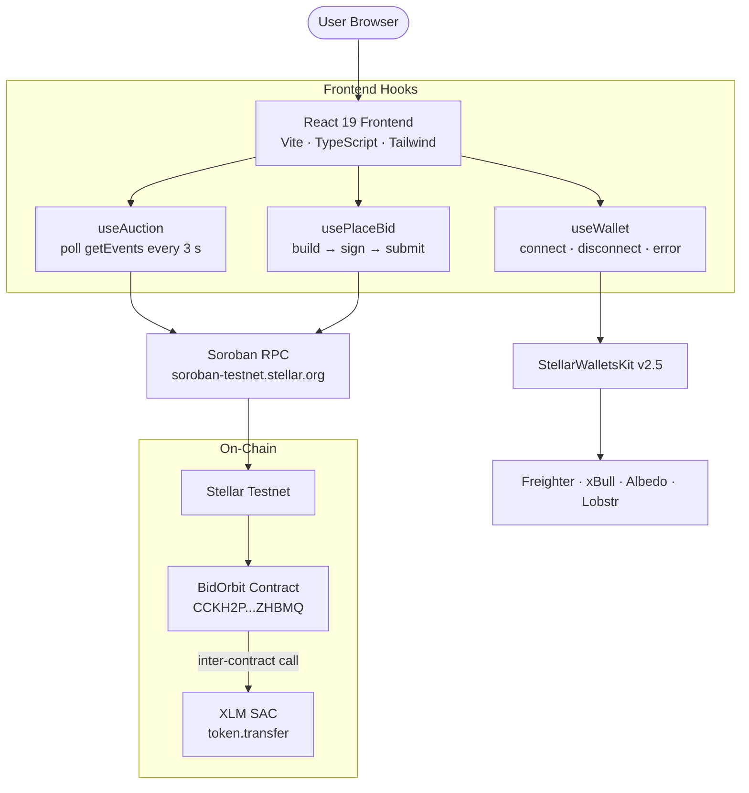
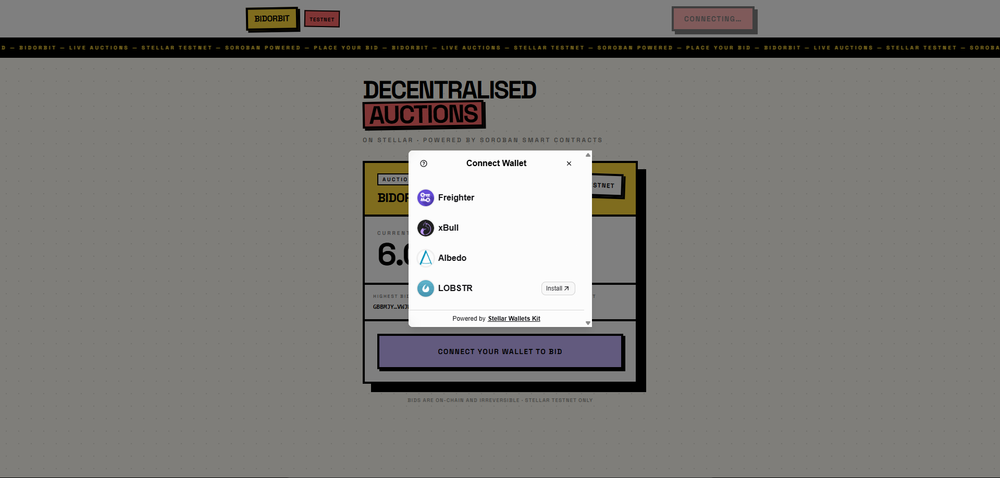
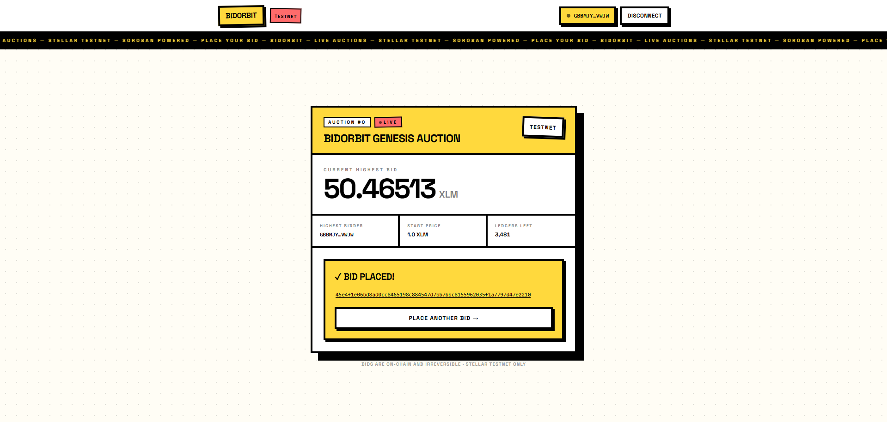
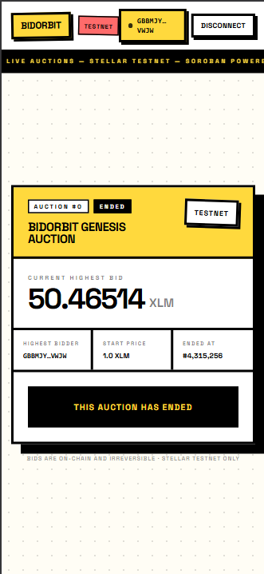
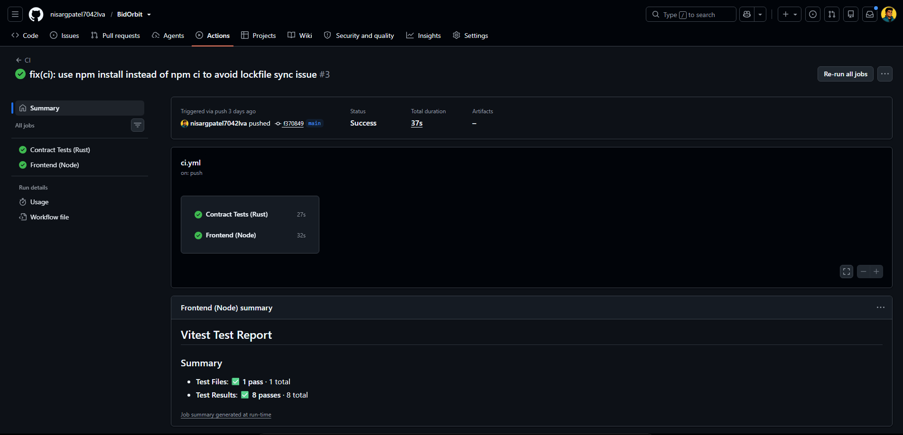
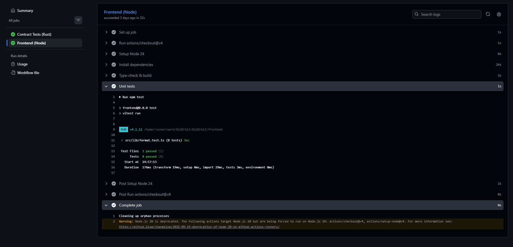

# BidOrbit

[](https://github.com/nisargpatel7042lva/BidOrbit/actions/workflows/ci.yml)

A decentralised English auction dApp built on Stellar using Soroban smart contracts. Users connect their Stellar wallet, view live auction state fetched directly from the chain, and place on-chain bids — with real-time updates, full transaction status tracking, and clear error handling throughout.

## Live Demo

**[https://bid-orbit.vercel.app/](https://bid-orbit.vercel.app/)**

## Demo Video

https://www.loom.com/share/placeholder — _replace with your 1–2 min walkthrough link_

## Features

- Multi-wallet support: Freighter, xBull, Albedo, Lobstr
- Real-time bid updates via Soroban RPC event polling (`getEvents` every 3 s)
- Inter-contract call: `place_bid` invokes the XLM SAC `transfer` function on-chain
- Client-side bid validation with clear minimum-bid guidance
- Three distinct error states: wallet not installed, bid too low, transaction rejected by user
- Full transaction status tracking: Building → Signing → Submitting → Success / Error
- Mobile-responsive neo-brutalist UI (Tailwind CSS v4)
- GitHub Actions CI: contract tests + frontend build + unit tests on every push

## Architecture



**Data flow for a bid:**
1. `useAuction` polls `getEvents` every 3 s and calls `simulateTransaction → get_auction_state` to display live state
2. User submits amount → `usePlaceBid` calls `buildPlaceBidTx` (fetches sequence from Horizon, simulates on RPC, attaches `SorobanAuthorizationEntry`)
3. Wallet signs the XDR envelope → submitted via `sendTransaction` → polled with `getTransaction` until `SUCCESS` or `FAILED`
4. On success, the tx hash links to stellar.expert; `useAuction` re-fetches updated state

## Tech Stack

| Layer | Technology |
|---|---|
| Smart contract | Soroban (Rust), soroban-sdk v26, Stellar testnet |
| Wallet integration | @creit.tech/stellar-wallets-kit v2.5.0 |
| Contract client | @stellar/stellar-sdk v13.3.0 (raw JSON-RPC for Protocol-22 compat) |
| Frontend | React 19 + TypeScript + Vite 8 + Tailwind CSS v4 |
| Testing | Rust native tests (20) · Vitest unit tests (8) |
| CI/CD | GitHub Actions — contract tests + frontend build + unit tests |

## CI / CD

Every push to `main` triggers two parallel jobs:

| Job | Steps |
|---|---|
| **Contract Tests (Rust)** | `cargo test` — runs all 20 Soroban contract tests |
| **Frontend (Node)** | `npm install` → `npm run build` (tsc + vite) → `npm test` (vitest) |

## Deployed Contract

**Contract ID:** `CCKH2P2QFWDKQTUALSEZJRT5WWAJPFKT5DD56VQKFAFDGVXIXW2ZHBMQ`

**Network:** Stellar Testnet

**Verified on-chain transactions:**

| Function | Transaction Hash | Explorer |
|---|---|---|
| `create_auction` | `af0016281d3c266fe8690fdbae773423c49735d42161e3b1d197b167f73ad602` | [View →](https://stellar.expert/explorer/testnet/tx/af0016281d3c266fe8690fdbae773423c49735d42161e3b1d197b167f73ad602) |
| `place_bid` | `63cb57d0e33ffa6325949f24067d3c8d51f95b4d38aaf2f08cd1df454792975e` | [View →](https://stellar.expert/explorer/testnet/tx/63cb57d0e33ffa6325949f24067d3c8d51f95b4d38aaf2f08cd1df454792975e) |
| `place_bid` | `ff27062215d379748206561b5f9db48895dca80072393a0abe2fdf2a18b25801` | [View →](https://stellar.expert/explorer/testnet/tx/ff27062215d379748206561b5f9db48895dca80072393a0abe2fdf2a18b25801) |

## Setup & Running Locally

### Prerequisites

- Node.js 24+
- Rust toolchain with `wasm32v1-none` target (for contract builds only)
- [stellar-cli](https://developers.stellar.org/docs/tools/developer-tools/cli/stellar-cli) v27+ (for contract deployment only)
- A Stellar testnet wallet (Freighter recommended)

### 1. Clone and install

```bash
git clone https://github.com/nisargpatel7042lva/BidOrbit.git
cd BidOrbit/frontend
npm install
```

### 2. Run the frontend

```bash
npm run dev
```

Open `http://localhost:5173` in your browser.

### 3. Run frontend unit tests

```bash
npm test
```

### 4. (Optional) Build the smart contract

```bash
cd contracts/bid-orbit
cargo build --target wasm32v1-none --release
```

### 5. (Optional) Run contract tests

```bash
cargo test
```

All 20 tests should pass.

## How to Use

1. Open the app and click **Connect Wallet**
2. Choose your wallet from the modal (Freighter, xBull, Albedo, or Lobstr)
3. The live auction card loads with the current highest bid and ledgers remaining
4. Enter a bid amount in XLM — must exceed the current highest bid
5. Click **Place Bid** and approve the transaction in your wallet
6. Once confirmed on-chain, the bid card updates and shows the tx hash linked to stellar.expert

## Error Handling

| Error | Trigger | Display |
|---|---|---|
| Wallet not installed | Extension missing | Red banner with install guidance |
| Bid too low (client) | Amount ≤ current highest bid | Inline red validation message |
| Transaction rejected | User cancels wallet prompt | Amber banner (distinct from errors) |
| Bid too low (on-chain) | Race condition, outbid between sign and submit | Red banner with contract error message |
| Network / RPC failure | Transient RPC error | Red banner with raw error |

## Screenshots

### Wallet selector — all 4 wallet options



### Live auction card with bid form



### Mobile responsive UI



### CI pipeline — all jobs passing



### Test output — 8 frontend + 20 contract tests



## Project Structure

```
BidOrbit/
├── .github/
│   └── workflows/
│       └── ci.yml              # GitHub Actions: contract tests + frontend CI
├── contracts/
│   └── bid-orbit/
│       └── src/
│           ├── lib.rs           # Soroban contract — 6 public functions
│           └── test.rs          # 20 passing tests
├── docs/
│   └── screenshots/             # Submission screenshots
├── frontend/
│   └── src/
│       ├── lib/
│       │   ├── wallet.ts        # StellarWalletsKit initialisation
│       │   ├── contract.ts      # Contract client + raw JSON-RPC helpers
│       │   ├── format.ts        # fmtXlm, truncate utilities
│       │   └── format.test.ts   # Vitest unit tests (8 tests)
│       ├── hooks/
│       │   ├── useWallet.ts     # Connect / disconnect / error state
│       │   ├── useAuction.ts    # Auction state + getEvents polling
│       │   └── usePlaceBid.ts   # Bid transaction state machine
│       └── components/
│           ├── WalletButton.tsx  # Navbar wallet UI
│           └── BidForm.tsx       # Auction card + bid form
└── README.md
```

## Level 3 Submission Checklist

- [x] Public GitHub repository
- [x] README with complete documentation
- [x] 13+ meaningful commits
- [x] Live demo: [https://bid-orbit.vercel.app/](https://bid-orbit.vercel.app/)
- [x] Contract deployment address: `CCKH2P2QFWDKQTUALSEZJRT5WWAJPFKT5DD56VQKFAFDGVXIXW2ZHBMQ`
- [x] Transaction hash: `63cb57d0e33ffa6325949f24067d3c8d51f95b4d38aaf2f08cd1df454792975e`
- [x] Inter-contract communication: `place_bid` → XLM SAC `transfer`
- [x] Event streaming & real-time updates: `getEvents` polling every 3 s
- [x] CI/CD pipeline: GitHub Actions (contract tests + frontend build + unit tests)
- [x] Mobile responsive UI: Tailwind CSS responsive classes throughout
- [x] Error handling & loading states: 5 distinct error cases + 3-phase tx status
- [x] Tests: 20 contract tests (Rust) + 8 frontend unit tests (Vitest)
- [x] Screenshot: wallet options
- [ ] Screenshot: mobile responsive UI _(add docs/screenshots/mobile-ui.png)_
- [ ] Screenshot: CI pipeline green _(add docs/screenshots/ci-pipeline.png)_
- [ ] Screenshot: test output _(add docs/screenshots/test-output.png)_
- [ ] Demo video link _(replace placeholder above with Loom/YouTube link)_
